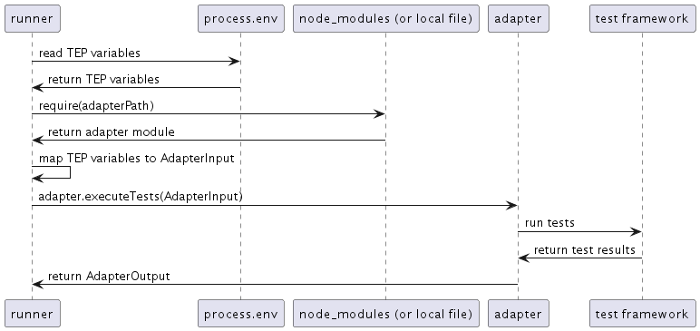

# Architecture of universal-test-runner

universal-test-runner is made up of two main components:
* A CLI, a.k.a the "runner"
* Built-in "adapters" (for jest, pytest, dotnet, maven, and gradle)

The project is organized as a monorepo using npm workspaces to manage multiple packages:
* The runner is its own package
* Each built-in adapter is its own package
* The remaining packages are utilities shared across the runner and adapter packages

The monorepo setup is not strictly necessary, but does provide a clear
separation between adapters, and necessitates that we structure the built-in
adapters in an identical way to third-party adapters or custom adapters. This
means that all adapters are loading using the same code path, regardless of
what kind of adapters they are.

## Sequence diagram

The following diagram describes at a high-level what happens when a user
invokes universal-test-runner via the CLI with an adapter, e.g. `run-tests
jest` or `run-tests ./my-adapter.js`. The steps are described in more detail
below, along with an outline of the separation between the runner and the
adapters and what their responsibilities are.

## The runner

The runner is responsible for the following:
* Reading the Test Execution Protocol variables from the environment (in this case, from process.env)
* Loading the correct adapter
* Transforming the protocol variables to and AdapterInput object
* Invoking the adapter with the correct AdapterInput
* Reporting results back to the user of the CLI

The runner has no specific knowledge of any test frameworks -- it should always
delegate any framework-specific behaviour to an adapter.

## Adapters

An adapter is responsible for invoking a single test framework in order to
execute tests.  An adapter should be associated with exactly one test
framework. Adapters must report the results of a test run by returning an
AdapterOutput object. Adapters should not expose any framework details to the
runner.

As of writing, all of the built-in adapters are using Node.js
`child_process.spawn` to invoke their frameworks as if they were being run on
the command line, but this is not required -- adapters can run the tests
however they so please, as long as the tests are run and execution status can
be reported back to the runner. For example, the jest adapter could conceivably
use jest-editor-support (https://www.npmjs.com/package/jest-editor-support) to
run the tests, instead of `spawn`.
