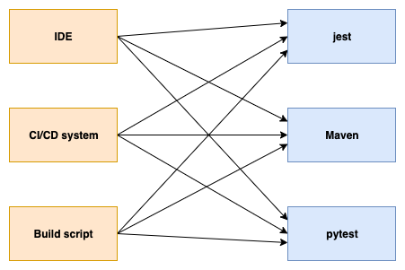
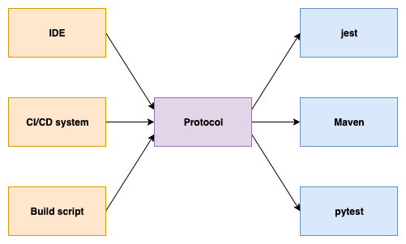

# 0001 Establish the Test Execution Protocol

## Motivation

The Test Execution Protocol establishes a common interface for passing
arguments to test runners. Test runners all have different ways of being
invoked in order to perform the same or similar tasks. For example, to run a
single test named "hello" in your project, you might run one of the following
commands, depending on what language and runner you're using:

```
$ jest -t "hello" 
$ pytest -k "hello"
$ mvn -Dtest=#hello test
```

By defining environment variables according to the Test Execution Protocol, we
can use the same command to execute our "hello" test, no matter the language or
test runner:

```
$ export RUN_TEST_WITH_NAME="hello"
$ bash ./generic-testing-script.sh
```

In this example, `RUN_TEST_WITH_NAME` is an environment variable defined by the
protocol, and `generic-testing-script.sh` is an example of a "protocol-aware"
test runner that knows how to interpret the protocol and execute the correct
test command for the language and framework being used. Our
`generic-testing-script.sh` must be able to identify what framework is being
used and know how to execute the tests, but as long as a framework is
supported, the same invocation strategy can be used across different contexts.
IDEs, CI/CD systems, and other build tools can use the protocol to easily add
support for new test frameworks. The idea is similar to the [Language Server
Protocol](https://microsoft.github.io/language-server-protocol/) in that tools
and frameworks don't have to explicitly support each other.

At a high-level, instead of this:



We have this:



which makes it much easier for tools to add support for new test frameworks.

## Definitions

From the above example we can pull out some important concepts:

* **Test framework**: Any library that allows users to define test cases in their language of choice. Examples are Jest (JavaScript), JUnit (Java), and Pytest (Python).
* **Test runner**: Any library or tool that executes tests defined by a test framework. Note that in many cases, the framework and runner are one in the same, as with Jest and Pytest -- installing the framework also gives you an executable that allows you to run the tests. In other cases, the runner is different from the framework -- for example, the [JUnit console runner](https://junit.org/junit5/docs/current/user-guide/#running-tests-console-launcher) is a test runner for the JUnit test framework. Maven would also count as a runner for JUnit, since it provides direct support for executing JUnit tests.
* **Protocol-aware runner**: Any test runner that is aware of the Test Execution Protocol and is able to execute tests according to what the protocol has specified. Note that protocol-aware runners may simply invoke other runners that are not aware of the protocol (such as our `generic-testing-script.sh` above), or they may actually be runners that have framework-specific knowledge.
* **Protocol environment variables**: The environment variables used to communicate inputs to protocol-aware runners.

## Protocol version 0.1.0

We define the first version of the protocol with the following environment variables:

* `TEP_VERSION` (string; required): The version of the protocol being used, adhering to [semantic-versioning](https://semver.org/).
  * Example: `export TEP_VERSION="0.1.0"`
  * If this value is absent, runners must use the latest version of the protocol supported supported by the runner, and should print a warning indicating that TEP_VERSION was not identified.
  * If a runner does not support the version indicated, it must fail with an error.
* `TEP_TESTS_TO_RUN` (string; optional): Pipe-separated list of test names to be executed by the runner.
  * Example: `export TEP_TESTS_TO_RUN="test1|test4|test9"`
  * If this value is absent, runners must run all possible tests that can be run, with no filtering.
  * File name and suite name can optionally be specified in the test name, using hashes:
    * Example: `export TEP_TESTS_TO_RUN="file.js#Test suite name#test1|file2.js#Test suite name#test4"`
  * In order to specify the file name without the suite name, leave the suite name blank, resulting in a double hash between the file name and test name:
    * Example: `export TEP_TESTS_TO_RUN="file.js##test1"`
* `TEP_TEST_REPORT_FORMAT` (string; optional): Format of the test report to generate; defaults to no report
  * Valid values: `junitxml`
  * Example: `export TEP_REPORT_FORMAT="junitxml"`
* `TEP_TEST_REPORT_OUTPUT_DIR` (string; optional): Directory where a generated test report will be written; defaults to unspecified (determined by the runner)
  * Example: `export TEP_REPORT_OUTPUT_DIR=path/to/reports/`
* `TEP_TEST_REPORT_FILE_NAME` (string; optional): File name of a generated test report; defaults to unspecified (determined by the runner)
  * Example: `export TEP_TEST_REPORT_FILE_NAME="report.xml"`
* `TEP_LOG_FILE_NAME` (string; optional): Path where the runner should write logging information after it has finished running tests.
  * If not present, the runner should write no log files
  * If present, the log file written should be in the following JSON format:
      ```typescript
      interface LogFile {
        logs: {
          timestamp: number // unix millisecond timestamp
          type: 'MESSAGE' | 'CUSTOM' | 'PROTOCOL_READ_START' | 'PROTOCOL_READ_END' | 'DISCOVERED_PROTOCOL_ENV_VARS' | 'TEST_RUN_START' | 'TEST_RUN_END' | 'PROTOCOL_VERSION'
          level: 'INFO' | 'ERROR' | 'DEBUG' | 'WARN'
          data: any
        }[]
      }
      ```
  * The runner should log the following `data` for the given log `type` at the specified `level`
    * [INFO] `PROTOCOL_READ_START`: `void`; this timestamp for this entry indicates the time at which the runner starts to read protocol variables from the environment
    * [INFO] `PROTOCOL_READ_END`: `void`; the timestamp for this entry indicates the time at which the runner finishes reading protocol variables from the environment
    * [DEBUG] `DISCOVERED_TEP_ENV_VARS`: `{ [key: string]: string }`; object map of env vars discovered by the runner
    * [DEBUG] `PROTOCOL_VERSION`: `string`; string indicating the version of the protocol being used
    * [INFO] `TEST_RUN_START`: `void`; the timestamp for this entry indicates the time at which the runner starts running tests
    * [INFO] `TEST_RUN_END`: `void`; the timestamp for this entry indicates the time at which the runner finishes running tests
  * The runner may log any number of string `MESSAGE` logs at the appropriate log level 
  * The runner may log any number of `CUSTOM` logs at level `DEBUG`, where `data` takes the type `{ type: string; data: any }`
